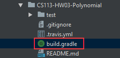
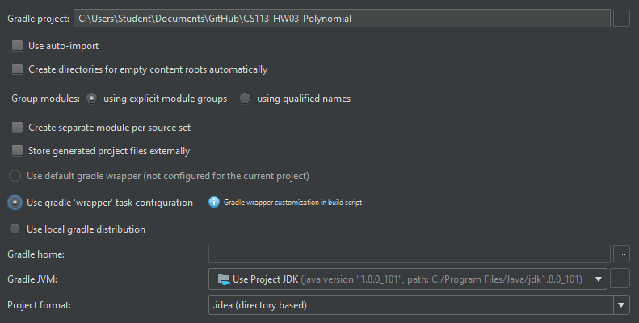
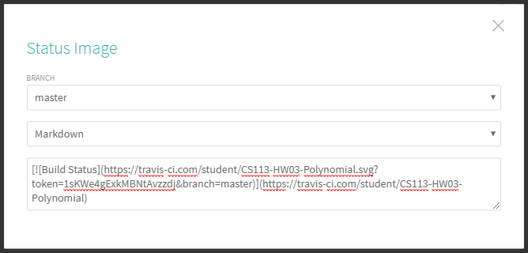

# Continuous Integration for Classroom Assignments

Using Gradle projects built from IntelliJ IDEA and monitored through GitHub and Travis CI, this guide will introduce the practice of **continuous integration** within in the context of **test-driven development** for classroom assignments.

## Importing an Existing Project

1. Select the GitHub Classroom invitation link associated with the current assignment. Once the individual assignment has been created, create a clone of its repository (refer to **GitHub Setup Guide + Assignment Clone** listed on Canvas, stopping at the steps for which a project is imported and proceed to step 2).

2. From the **IntelliJ IDEA** ‘Welcome’ screen, select **Import Project**, locate the project’s main directory in the **Select File or Directory to Import** window, and select the **build.gradle** file. Selecting the file directly guarantees that the IDE will recognize the project as a Gradle project.



3. On the **Import Project from Gradle** page, uncheck **Create separate module per source set**, and select the radio button for **Use default gradle wrapper**. The Gradle Wrapper allows students to use Gradle without having to install it manually.



4. Proceed with the remaining import settings for the project to complete its importation.

5. Gradle will automatically begin its build task to sync with the project in IntelliJ, creating the following items:

```
cs113-hw03-polynomial-student
│
├─ ...
│
├─ gradle/wrapper
│  ├─ gradle-wrapper.jar
│  └─ gradle-wrapper.properties
│
├─ gradlew
└─ gradlew.bat
```

`gradle-wrapper.jar` The wrapper JAR file containing code for downloading the Gradle distribution.

`gradle-wrapper.properties` A properties file responsible for configuring the Wrapper runtime behavior.

`gradlew`, `gradlew.bat` A shell script and a Windows batch script for executing the build with the Wrapper.

By convention, these files may exist within the project’s repository without interference by the student. In other words, allow these files to be committed to the project’s repository. 

6. Optionally, running individual tasks and the project’s assembly and test configurations may be accessed from the Gradle tab in the right sidebar:


## Project Structure

1. Excluding the items generated by the Gradle wrapper, the general structure for subsequent projects should look something like the following example:

```
cs113-hw03-polynomial-student
│
├─── resources
│    └─ polynomialUML.png
│
├─── src
│    └─── edu/miracosta/cs113
│         ├─ Term.java
│         └─ Polynomial.java
│
├─── test
│    └─── edu/miracosta/cs113
│         ├─ TermTest.java
│         └─ PolynomialTest.java
│
├─ README.md
├─ build.gradle
├─ .travis.yml
└─ .gitignore
```

As defined in the build.gradle file, the expected names for the project’s main and test directories are ‘**src**’ and ‘**test**’ respectively. Otherwise, builds through the CI software will fail before it gets the chance to run the project’s JUnit tests. 

2. For every class in a given project, include the line package `edu.miracosta.cs113;` before the class header. The use of packages serves to practice data encapsulation, or access protection between classes.

Lastly, the **README.md** file must include a build status badge as provided by Travis CI. Proceed to the final section to accomplish this.

## Accessing and Using Travis CI

1. Log in to https://travis-ci.com/, or register by selecting **Sign up with GitHub** and logging in through GitHub, therefore granting Travis CI access to the account’s private repositories. 

2. Upon cloning the assignment’s repository, Travis CI detects its **.travis.yml** configuration file and runs its first build. In the case of HW03, the first build should fail due to the absence of the classes named in the test class.

3. Add the build status badge to the project’s **README.md** file. Select the **status image** next to the project’s title in Travis Ci, select **markdown** from the **Image Url** dropdown menu, and copy the resulting code. 



4. Insert this code into the **README.md file**, just below the second header, and commit and push this change to the project’s repository. 


Builds may now be accessed through clicking the build status image from GitHub or logging into https://travis-ci.com/. Viewing the **Job log** presents data similar to running the project’s JUnit tests manually or invoking the Gradle tasks/configurations through IntelliJ IDEA.

From this point, coding and testing is readily observable through both a **version control system** (in our case, Git) and **continuous integration** software (Travis CI). Exposure to industry-standard tools and practices utilized in software engineering will prove to be beneficial to your progress in computer science and related disciplines. 
